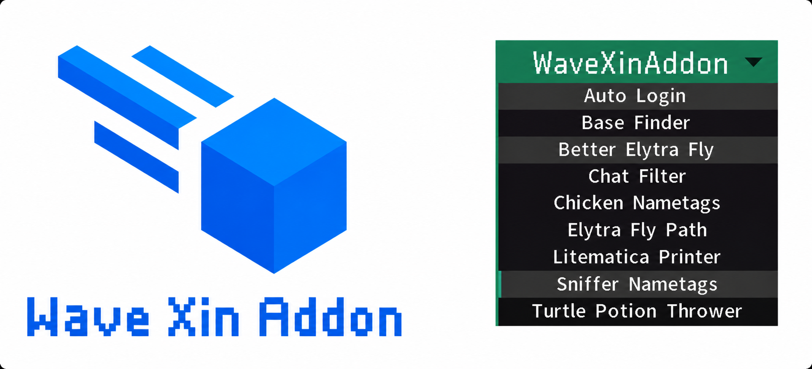

# WaveXinAddon

**语言 / Language:** 中文 | [English](README_EN.md)

WaveXinAddon 是一个为 **2b2t.xin** 服务器设计的 Meteor Client Addon (彗星段扩展)，主要提供鞘翅飞行、路径飞行、自动登录、自动答题、自动每日小红花（月卡）、基地扫描、聊天过滤和实体名牌显示等辅助功能。

<p align="center">
  
</p>

## 功能

* Better Elytra Fly：鞘翅飞行辅助
* Simple Elytra Fly Path：简单坐标路径飞行
* ChickenNametags：鸡实体名牌显示
* SnifferNametags：嗅探兽实体名牌显示
* Auto Login：2b2t.xin 自动登录、自动加入和每日小红花签到
* Chat Filter：私信、公共聊天和死亡消息过滤
* Base Finder：普通扫描 / 螺旋扫描、容器记录和可选 Xaero 路径点

## 环境要求

* Minecraft 1.21.11
* Java 21
* Fabric Loader
* Fabric API
* Meteor Client
* Baritone

## 构建方法

Windows：

```powershell
.\gradlew.bat clean build --stacktrace --console=plain
```

Linux / macOS：

```bash
./gradlew clean build --stacktrace --console=plain
```

构建完成后，mod 文件会生成在：

```text
build/libs/
```

请使用普通 jar 文件，不要使用 `sources` 或 `dev` jar。

## 安装方法

将构建出的 WaveXinAddon jar 文件放入 Minecraft 的 `mods` 文件夹中，并确保同时安装：

* Fabric API
* Meteor Client
* Baritone

## 配置文件

WaveXinAddon 的配置文件会自动保存到：

```text
meteor-client/wavexin/
```

## 说明

本项目主要为 2b2t.xin 使用场景设计。请自行确认服务器规则，并自行承担使用风险。

## Credits

WaveXinAddon was originally inspired by [EasyAddon](https://github.com/IDhammaI/easyaddon) by IDhammaI.

Spiral Scan is inspired by [WTmbp](https://github.com/2698269088/WTmbp) by 2698269088.

WaveXinAddon is now **independently** modified and maintained by WaltomAdaam.

## License

See [LICENSE](LICENSE).

WaveXinAddon is licensed under the GNU General Public License v3.0.
Copyright (C) 2026 WaltomAdaam2.